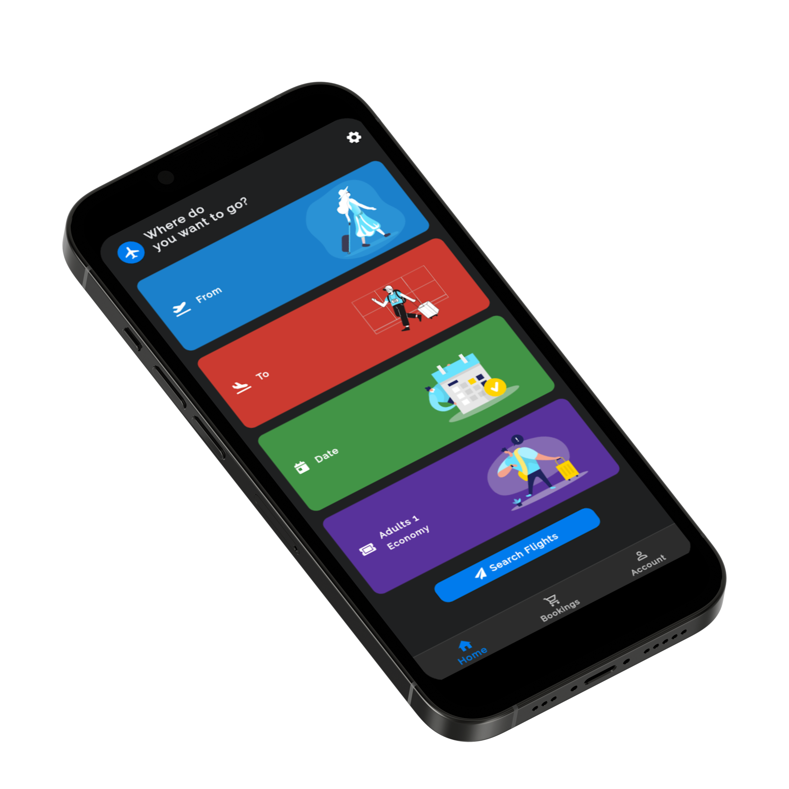
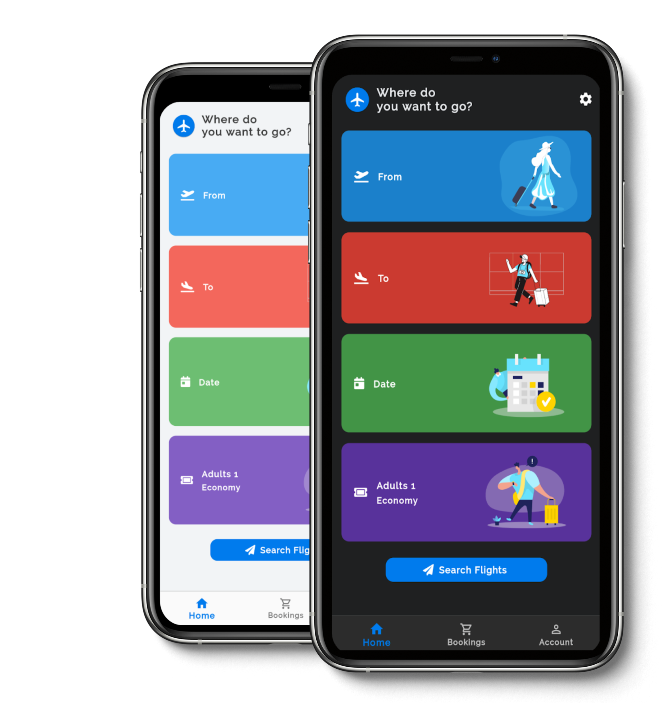

# Ticketo

    

This online air ticketing system called **Ticketo**  is a computerized system used to store and retrieve information and conduct transactions related to air travel. The project is aimed at exposing the relevance and importance of Airline Reservation Systems. It is projected towards enhancing the relationship between customers and airline agencies and thereby making it convenient for the customers to book flights when they require such that they can utilize this software to make reservations. The main purpose of this software is to reduce the manual errors involved in the airline reservation process and make it convenient for the customers to book flights when they require such that they can utilize this software to make reservations, modify reservations or cancel a particular reservation. 

When a customer opens the application, it allows the user to search for any flights by selecting the source and destination address. The system displays all the flight’s details such as flight no, name, price and duration of journey etc. For booking, he must be logged into the system. To book a flight, the system asks the customer to enter his details such as name, address, city, state, credit card number and contact number. Then it checks the validity of the card and books the flight and updates the database accordingly. The system also allows the customer to cancel his/her reservation within a certain time period if any problem occurs. After booking, he/she can view the ticket details.

 

# Implementation

-   ## Home Page

       

      

          
      

-   ## Passenger Details     

       

      

          
      

    
     

-   ## All Bookings

       

      
 
          
      

-   ## Flight Booking Details

       

      

          
      

-   ## Profile page

       

      

          
      

## Full Working of the Application
    
 

https://user-images.githubusercontent.com/30615934/234600802-2e152914-891f-40a5-a4fe-b4587cdb9d98.mp4

